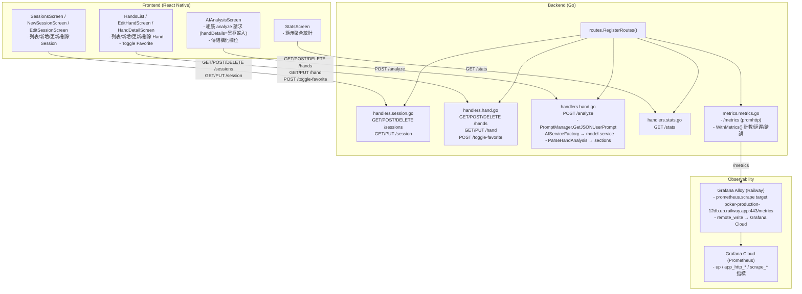

## Poker Tracker 系統架構

### 目的
- **端到端總覽**：快速理解前端 ⇄ 後端 ⇄ 監控的資料流與邊界
- **API 索引**：列出所有現有後端 API 與用途，對照前端呼叫點

### 後端 API 與用途
- **GET `/health`**：健康檢查，回傳服務狀態與功能旗標
- **GET `/metrics`**：Prometheus 指標端點（由 Alloy 抓取並上傳 Grafana Cloud）
- **GET `/sessions`**：讀取所有 Session
- **POST `/sessions`**：新增 Session（若無 `id` 則後端產生 UUID）
- **DELETE `/sessions?id=<id>`**：刪除 Session
- **GET `/session?id=<id>`**：讀取單一 Session
- **PUT `/session?id=<id>`**：更新單一 Session
- **GET `/hands`**：讀取所有 Hand
- **POST `/hands`**：新增 Hand
- **DELETE `/hands?id=<id>`**：刪除 Hand
- **GET `/hand?id=<id>`**：讀取單一 Hand
- **PUT `/hand?id=<id>`**：更新單一 Hand（含 `analysis_sections`）
- **POST `/toggle-favorite?id=<handId>`**：切換手牌最愛狀態
- **GET `/models`**：取得可用 AI 模型清單（由 `AIServiceFactory` 提供）
- **GET `/stats`**：聚合統計（總利潤、勝率、依盜盲/場館彙總）
- **POST `/analyze`**：呼叫 AI 做手牌分析
  - 必填：`hero_position`, `hero_hole_cards`, `session.small_blind`, `session.big_blind`
  - 可選：`handDetails`（只含使用者黑框輸入）、`board`, `result`, `notes`, `villains[]`, `streets_to_analyze`, `language`, `model`
  - 後端：以 `PromptManager.GetJSONUserPrompt` 組裝結構化 JSON；轉卡面短碼；不注入 `session.date` 與 `villains[].id`
  - 回傳：`analysis`、`date`、`sections`（解析後或直接從結構化物件取）

### 端到端流程圖（Frontend ↔ Backend ↔ Observability）

### 備註
- 前端 `handDetails` 僅包含使用者黑框輸入，避免與結構化欄位重複。
- 後端會把 `hero_hole_cards` / `board` 轉為短碼（例如：`9h 9d`），並省略 `session.date` 與 `villains[].id`。
- 監控：在 Grafana Explore 使用 job（例如 `prometheus.scrape.railway_poker`）查詢 `up`、`app_http_requests_total`、`app_http_request_duration_seconds_*`、`app_http_errors_total`。
